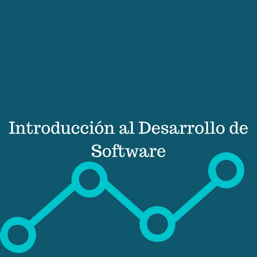
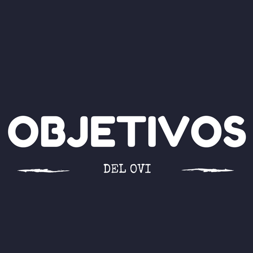

# Introducci-n-al-desarrollo-de-software.OVI
<htmL>
<header></header>
<head>
<title>  OVI  </title>

</head>
<link rel="stylesheet" type="text/css" a href="andychill/estilos/estilos.css">
<link rel="stylesheet"  href="andychill//estilos/fonts.css">

<h1 align=center>
</IMG>
</h1> 

<noscript></noscript>

         

<body background="andychill/imagenes/b.jpg">

<nav>
<h4><align left>

<ul>
<H1>
<li class="navhome"><a href="andychill/Inicio.htmL">Objetivos </a></li>
<li class="navhome"><a href="andychill/Lecturas.htmL">Lecturas</a></li>
<li class="navhome"><a href="andychill/Multimedia.htmL">Multimedia</a></li>
<li class="navhome"><a href="andychill/Autores.htmL">Autores</a></li>
</H1>
</ul>

</align></h4>
</nav>

<H1>
<I>

  

  

  

  

  

  

  

  

  

  

  

  

  

  

  

  

  

  

  

  

</I>
 </H1>

 

<H2><article><aside>

Un proceso de desarrollo de software tiene como proposito la produccion eficaz y eficiente de un producto software que reuna los requisitos del cliente. 
Este proceso es intesamente intelectual, afectodo por lacreatividad y juicio de las personas involucardas.
Aunque un proyecto de desarrollo de software es equiparable en muchos aspectos acualquir otro proyecto de ingenieria, en el desarrollo de software hay una serie de desafios adicionales, 
relativos esencialmente a la naturaleza del producto.
 
</aside></article></H2>

		<ul>
			<li></li>
			<li></li>
			<li></li>
                        <li></li>
		</ul>
	

</body>

# Inicio
<html>

<title>Objetivos</title>
<header></img></header>
<head>
<body background="andychill/imagenes/a.jpg">
<link rel="stylesheet" type="text/css" a href="andychill/estilos/estilos.css">
<link rel="stylesheet"  href="andychill/estilos/fonts.css">

</head>

<H1></IMG></H1>
 

<article><H2>
<ul type="square"> 
<li>Orientar al programador en los pasos a seguir para saber cómo desarrollar un software.</li> 
<li>Identificar los diferentes métodos de desarrollo de software, ventajas y desventajas de cada uno.</li>
<li>Conocer los diferentes métodos de desarrollo de software, ventajas y desventajas de cada uno.</li>
<li>Saber cómo hacer el despliegue y mantenimiento del software.</li>
</ul>
</H2>
</article>

<H1><I>TEMATICAS DEL DEL CURSO</I></H1>
 

</IMG>

<ul> 
<H1>
1.	Etapas:
</H1>
<H4><li>
Wáter fall
</li></H4>
<H2><article>
En Ingeniería de software el desarrollo en cascada, también llamado modelo en cascada 
(denominado así por la posición de las fases en el desarrollo de esta, que parecen caer en cascada “por gravedad” hacia las siguientes fases), 
es el enfoque metodológico que ordena rigurosamente las etapas del proceso para el desarrollo de software,
 de tal forma que el inicio de cada etapa debe esperar a la finalización de la etapa anterior.

 
Al final de cada etapa, el modelo está diseñado para llevar a cabo una revisión final, 
 que se encarga de determinar si el proyecto está listo para avanzar a la siguiente fase. 
 Este modelo fue el primero en originarse y es la base de todos los demás modelos de ciclo de vida.
</article></H2>

<article>
<H2>La versión original fue propuesta por Winston W. Royce en 1970 y posteriormente revisada por Barry Boehm en 1980 e Ian Sommerville en 1985.
Un ejemplo de una metodología de desarrollo en cascada es:</H2>

<H2><ol type="1" start ="1">
<li>Análisis de requisitos.</li>
<li>Diseño del sistema.</li>
<li>Diseño del programa.</li>
<li>Codificación.</li>
<li>Pruebas.</li>
<li>Implementación del programa.</li>
<li>Mantenimiento.</li>
</ol></H2>

<article><H2>
De esta forma, cualquier error de diseño detectado en la etapa de prueba conduce necesariamente al rediseño
 y nueva programación del código afectado, aumentando los costos del desarrollo. 
 La palabra cascada sugiere, mediante la metáfora de la fuerza de la gravedad, el esfuerzo necesario para introducir un cambio en las fases más avanzadas de un proyecto.

<a href="https://es.wikipedia.org/wiki/Desarrollo_en_cascada" target="_blank">wikipedia/Desarrollo en cascada</a></H2></article>

<li><h4>
Test driven development
</h4>
<article><H2>
 Desarrollo guiado por pruebas de software, o Test-driven development (TDD) es una práctica de ingeniería de software 
que involucra otras dos prácticas:
</H2></article>
 <article><H2>
Escribir las pruebas primero (Test First Development) y Refactorización (Refactoring). 
 Para escribir las pruebas generalmente se utilizan las pruebas unitarias (unit test en inglés).
 
 
En primer lugar, se escribe una prueba y se verifica que las pruebas fallan. 
 A continuación, se implementa el código que hace que la prueba pase satisfactoriamente y seguidamente se refactoriza el código escrito.
</H2></article> 
 <article><H2>
El propósito del desarrollo guiado por pruebas es lograr un código limpio que funcione. 
 La idea es que los requisitos sean traducidos a pruebas, de este modo, cuando las pruebas pasen se garantizará que el software cumple con los requisitos 
 que se han establecido.

 <a href="https://es.wikipedia.org/wiki/Desarrollo_guiado_por_pruebas" target="blank">wikipedia/Desarrollo guiado por pruebas</a></H2></article>

 
<H4><li>Agile methodologies</li></H4>

<article><H2>
El desarrollo ágil de software envuelve un enfoque para la toma de decisiones en los proyectos de software, 
que se refiere a métodos de ingeniería del software basados en el desarrollo iterativo e incremental, 
donde los requisitos y soluciones evolucionan con el tiempo según la necesidad del proyecto.

Así el trabajo es realizado mediante la colaboración de equipos auto-organizados y multidisciplinarios, 
inmersos en un proceso compartido de toma de decisiones a corto plazo.
<a href="https://es.wikipedia.org/wiki/Desarrollo_%C3%A1gil_de_software" target="blank">wikipedia/Desarrolo agil de software</a></H2></article>

		<ul>
			<li></li>
			<li></li>
			<li></li>
			<li></li>
                        <li></li>
		</ul>
	

</body>

#Lecturas
<html>
<header></header>
<link rel="stylesheet" type="text/css" a href="andychill/estilos/estilos.css">
	<link rel="stylesheet"  href="andychill/estilos/fonts.css">
<title>Lecturas</title>
<head>
<body background="andychill/imagenes/c.jpg">

<H1></IMG></H1>
 
</head>
<article><H2>

Las lecturas que encontraremos aqui nos permitiran conocer mas a fondo la Ingenieria de Desarrollo de Software.

</H2></article>
<article>
<h4>
Adelante!!!
</h4>
</article>
<article>

<ul>

<li class="navhome"><a href="andychill/pdf/DESARROLLO DE SFTW.pdf"><h1>Lectura sobre el desarrollo de software</h1></a></li>

<li><a href="andychill/pdf/computacion05.pdf"><h1>Metodologias para el desarrollo de software </h1></a></li>

<li><a href="andychill/pdf/software de visualizacion.pdf"><h1>Software de vizualizacion</h1></a></li>

</ul>

</article>

		<ul>
			<li></li>
			<li></li>
			<li></li>
                        <li></li>
		</ul>
	

</body>

#Autores
<html>
<header></header>
<head>

<link rel="stylesheet"  href="andychill/estilos/fonts.css">
<link rel="stylesheet" type="text/css" a href="andychill/estilos/estilos.css">

<body background="imagenes/f.jpg">
 

<h1>AUTOR</h1> 

 <h1 align=center></IMG></h1>
 
<h1>
2017
 </h1>

		<ul>
			<li></li>
			<li></li>
			<li></li>
            <li></li>
		</ul>
	

</body>

</head>

#MULTIMEDIA
<html>
<header></header>

<body background="andychill/imagenes/d.png">
	<title>multimedia</title>
	<link rel="stylesheet" type="text/css" a href="andychill/estilos/estilos.css">
	<link rel="stylesheet"  href="andychill/estilos/fonts.css">

 <h1 align=center></IMG></h1>
 

	
<article><H2>

Aqui encontraremos videos y paginas web referentes al desarrollo de software

</H2></article>
	
	
<article><h2>

Esta por ejemplo es una pagina especializada en el desarrolo de software(mantenimineto, planeación, diseño, implantación etc)

<a href="http://bluesoft.com.co/?gclid=CjwKEAjwoLfHBRD_jLW93remyAQSJABIygGpF-6cPvfcwJ5Kzdpbm7yFWjJCEKJbn1fil_tRl09N5xoCQqfw_wcB" target="blank">Blue Soft</a>
</h2></article>

<article><h2>

Y este es un video el cual te dara una vista basica de lo que significa el desarrollo de software
 
</h2></article>

<iframe width="560" height="315" src="https://www.youtube.com/embed/5eUyXlfCgoI?ecver=1" frameborder="0" allowfullscreen></iframe>	
	</H2></article>

	

		<ul>
			<li></li>
			<li></li>
			<li></li>
                        <li></li>
		</ul>
	

</body>
</html>

